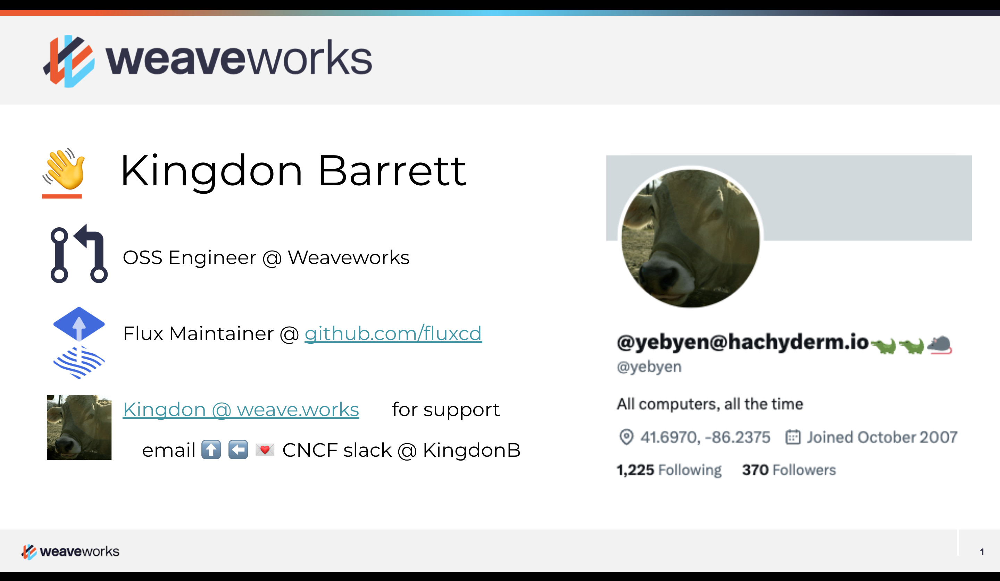

# CNCF On-Demand Webinar

subtitle
:   Basics of Flux and GitOps

author
:   Kingdon Barrett

institution
:   Weaveworks

theme
:   rabbit-theme-wwinternalstyle

date
:   2023-09-14

allotted-time
:   5m

# Flux in 2 Minutes

# GitOps

* For Beginners: (ELI5)
* {::wait/}Developer just pushes changes
* {::wait/}(**new desired state**) to Git
* {::wait/}They go automatically to **Kubernetes**

(User Experience should be simple)

# GitOps

* For Beginners: (ELI5)
* **Developer** just pushes changes
* (*new desired state*) to _Git_
* {::wait/}...notify us if everything went alright

(User Experience should be simple)

# GitOps

* Developer just pushes changes to **Git**

* {::wait/}...in case anything changes, <->
  **GitOps** reconciling (**Flux**)
  will automatically put it back
  This is called **Drift Correction**

Dist. from regular imperative CI/CD

# 4 Principles of GitOps

1. **Declarative** Configuration
1. {::wait/}*Versioned* Storage
1. {::wait/}Pulled _automatically_
1. {::wait/}Reconciled _continuously_

Detail: [opengitops.dev](https://opengitops.dev) from GitOps WG

# Diagram

```mermaid
flowchart LR

A((User))
B(Git Host)
F((Flux))
A --> B --> F

L((Kubernetes))

F --> L
```
{:
  relative_height="60"
}

Easy Version

# How Flux does GitOps

```mermaid
flowchart LR

subgraph Internet
A((User))
B(Git Host)
A --> B
end

subgraph Cluster
subgraph Flux
G -- pull --> B
G((GitRepository))
K((Kustomization))
G --> K
K --> G
end

L((K8s))
K --> L
end
```
{:
  relative_height="110"
}

# Flux is hosted on a K8s cluster

# _ 

```mermaid
flowchart LR

subgraph Internet
A((User))
B(Git Host)
W(Webhook)
end

A --> B --> W -- notify --> R

subgraph Cluster
subgraph Flux
R((Receiver))
G -- pull --> B
G((GitRepository))
K((Kustomization))
G -- notify --> K
K -- pull --> G
R --> G
end

L((K8s))
K --> L
end
```
{:
  relative_height="110"
  relative_margin_top="-5"
  hide_title=true
}

# Subscriptions in K8s are automatic

# Subscriptions in K8s are negotiated automatically

* On the other hand, across the internet (GitHub, GitLab, Gitea, CodeCommit, ...)
* {::wait/}Webhooks typically need configured

# Flux is Community

* {::wait/}Flux Developed in open under CNCF
* **Weekly Dev Meetings** - Public (Zoom)
* {::wait/}Transparent RFCs, Public Roadmap

[fluxcd.io/#calendar](https://fluxcd.io/#calendar)

# Flux is Supported

{:
  relative_height="120"
  relative_margin_top="3"
}

# Flux Manages Itself

# GitOps

If this is GitOps...

```mermaid
flowchart LR

A((Dev))
B(Git)
A --> B

L((K8s))

B --> L
```
{:
  relative_height="60"
}

# Flux does GitOps

And Flux does GitOps...

```mermaid
flowchart LR

A((User))
B(Git Host)
F((Flux))
A --> B --> F

L((Kubernetes))

F --> L
```
{:
  relative_height="60"
}

# How does Flux get installed?

```mermaid
flowchart LR

A((User))
B(Git Host)
C(("Operator (??)"))
F((Flux))
L((Kubernetes))

A --> B --> F --> L
F --> C -->|Install?| B
```
{:
  relative_height="90"
}

# How does Flux get installed?

??? That's up to you

* {::wait/}?: copy Flux into Git
* {::wait/}^- Typically: `flux bootstrap` does this

# What is Bootstrap?

# Bootstrap Decomposed

* `clusters/my-cluster/`
  * `flux-system/`
    * `gotk-components` - Flux itself (controllers)
    * _`gotk-sync`_ - Business end of Flux (_config_)

K8s CRs `GitRepo` and `Kustomization`
represent a running Flux installation

# Bootstrap Decomposed

* Bootstrap also sets up some secrets
* Repository secrets: usually SSH key
* {::wait/}Read-only by default,
* {::wait/}(but needs write access to bootstrap)

# How does Flux get installed?

* *?:* copy Flux controllers into _Git_? *no*
* {::wait/}Other possibility: Flux is **managed by**
  GitOps only some other way ... **how?**

Another **Operator** can install Flux!

# Flux as OCI Artifact

{::wait/}You do not need to copy Flux into Git

* (controllers **released** as OCI artifact){::wait/}

`oci://ghcr.io/fluxcd/
  flux-manifests:v2.1.0`

* {::wait/}`OCIRepository` is another Flux
**source `Kind`** - more about that later

# Demo
